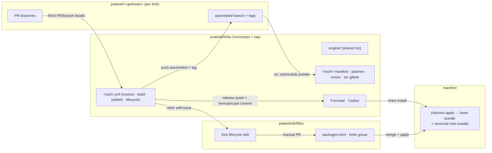
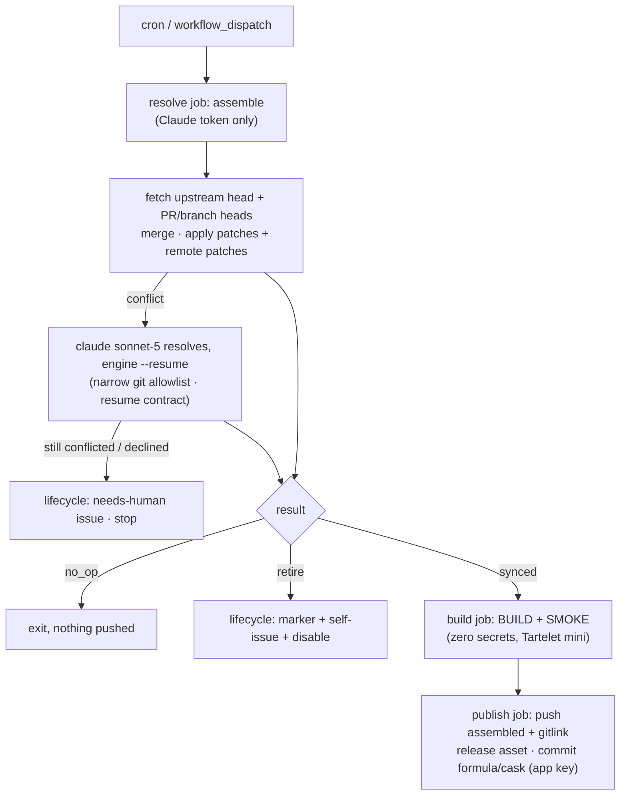

# downstream-fork: daily-driver forks

## Goal

Running "upstream + my open PRs (+ occasional local-only patches)" as the
daily driver should be nearly zero-maintenance, for macOS apps and CLIs.
Each fork tracks upstream daily, drops patches as they land upstream, and
retires itself when nothing is left to carry. Design rationale:
[ADR 0015](../adr/0015-downstream-fork-daily-driver.md). Fleet operations live
in the `fork-ops` skill in `prateek/forks`; the dotfiles side (adopt/retire in
`packages.toml`) is the
[`fork-lifecycle` skill](../../.agents/skills/fork-lifecycle/SKILL.md).

This work replaced the `setup-downstream-fork` skill and its clone-as-base
architecture ([ADR 0001](../adr/0001-downstream-fork-architecture.md),
superseded). The fleet then moved into one monorepo; the current shape is the
[ADR 0015 amendment](../adr/0015-downstream-fork-daily-driver.md#amendment-2026-07-04--fleet-monorepo).

## Shape of the system

One public repo, `prateek/forks`, holds every fork and is its own Homebrew tap.

The sync tick (daily cron + dispatch): three jobs so untrusted upstream code
never shares a runner with credentials.

Adopt and retire are manual: the fork files a self-issue, and `packages.toml`
edits are ordinary human/agent PRs via the `fork-lifecycle` skill.
`chezmoi apply` then swaps the install either way.

## Phases

Engine, template, harness, the security review, the `prateek/forks` scaffold,
and the fleet digest are done, and the dotfiles side (including the retoken to
the `prateek/forks` tap) is landing as one change. The only thing left is the
live ghost-pepper publish, blocked on recovering a wedged mini runner; until it
ships the cask, installing `prateek/forks/ghostpepper-fork` fails, which is
accepted.

1. **Engine — resume contract + monorepo nesting** — done. Conflict pauses
   snapshot `.git/config` + index; `--resume` restores them and reverts any
   resolver change outside the conflicted set; engine git runs with hooks and
   fsmonitor neutered. The engine operates on a fork dir nested in an outer
   monorepo. txtar-pinned.
2. **Engine — generalized sources** — done. `[branches]` (fork-remote branches,
   merged after PRs, auto-dropped when upstreamed) and `[[patches.remote]]`
   (`{url, sha256}`, mismatch fails loudly). Folded into drift/lock/retire.
3. **Three-job template** — done. `resolve → build → publish` + `lifecycle`,
   tar-artifact handoff, per-job GitHub secrets (no 1P in CI), assembled push +
   gitlink, in-repo tap. actionlint-clean.
4. **Harness reshape** — done. Monorepo-shaped seed (shared engine + nested
   tool dir + fork repo with a branch); engine verified live on Forgejo
   (Gitea-REST PRs, branch merge, nesting, conflict pause/resume). Full CI
   three-job run is a real-GitHub property (see phase 7).
5. **Create `prateek/forks`** — done. Scaffolds engine/templates/harness as the
   canonical home, fleet `AGENTS.md` + `fork-ops` skill, `CLAUDE.md`/`.claude`
   symlinks, `Formula/`+`Casks/`, and monorepo CI (`engine-ci`, `actionlint`);
   both meta workflows green.
6. **Dotfiles gardening** — done. Deleted the `fork-lifecycle.yml`/`review.yml`
   automation + issue template and the dotfiles engine skill package (with its
   Makefile/CI target); added the `fork-lifecycle` skill; repointed docs;
   retokened `packages.toml` to the `prateek/forks` tap (`ghostpepper-fork`
   entry + a URL-bearing tap entry), pointed the reconciler's tap constant at
   `prateek/forks`, and taught it to `brew tap` the non-conventional tap with its
   URL. `chezmoi apply` installs the fork once the monorepo ships the cask.
7. **Provision + migrate ghost-pepper + real E2E** — in progress. Done: app
   trimmed to contents-only and installed on `prateek/ghost-pepper`;
   `prateek/forks` added to the Tartelet runner app; the three secrets seeded via
   `scripts/sync-fork-secrets` (a service-account read of the vault, UUID-pinned);
   ghost-pepper rendered into the monorepo tracking PRs #141 + #143. CI proven up
   to the build: `resolve` merges both PRs clean and the Release build reaches
   `BUILD SUCCEEDED`. Remaining: the publish leg (assembled push → release →
   cask) and `brew install` verification, blocked on recovering a wedged mini
   runner. The dotfiles retoken already landed (phase 6), so once the cask ships
   `chezmoi apply` picks it up with no further dotfiles change.
8. **Fleet digest** — done. Scheduled workflow in the monorepo
   (`fleet-digest.yml` + `fleet-digest.py`) upserts a pinned fleet-status issue;
   verified green with the empty-fleet rendering.
9. **Adversarial security review** — done. Two no-context subagents reviewed the
   rendered workflow (workflow-attack + correctness lenses); confirmed findings
   folded into the template (upstream-fork-scoped mint, state-integrity gate,
   deny-by-default permissions, per-forge auth header, run-attempt tag,
   null-safe cost math). Threat model and accepted residuals in ADR 0015.

## Risks being carried

- App forks are ad-hoc signed; the reconciler installs casks with
  `--no-quarantine`. Entitlement-heavy apps may need a Developer ID.
- **Tartelet LAN exposure (accepted).** macOS builds run untrusted upstream
  code on the homelab minis, whose Tart guests NAT onto the LAN. Softnet
  isolation was not verified; the exposure is accepted for this personal fleet
  (ADR 0015 threat model).
- **Heavy builds can wedge a mini.** Back-to-back Xcode builds — worst case an
  `@testable` Debug rebuild — OOM/thrash the runner host into a freeze; SSH and
  the GitHub heartbeat both die while the runner still shows `busy`. Mitigations:
  the smoke is build-only (no Debug rebuild), cap Tartelet to one concurrent VM
  during fork builds, and keep a networked smart plug on the headless mini so a
  power-cycle needs no hands.
- A green-smoke-but-bad sync can ship; rollback is installing the previous
  release, supervision is disabling the workflow.
- Cross-job artifact + multi-runner semantics are only proven on real GitHub;
  the local harness verifies the engine, not the three-job CI shape.
